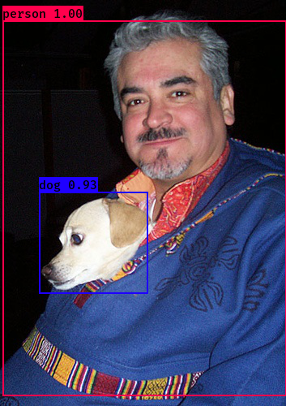
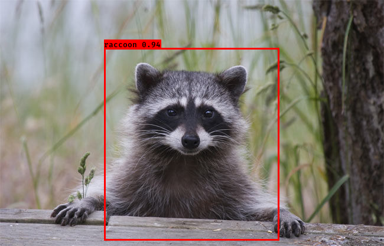
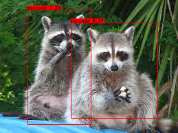

# keras-yolo3

## Introduction

A keras implementation of YOLOv3 (Tensorflow backend) for raccoon detection (ref: [qqwweee/keras-yolo3](https://github.com/qqwweee/keras-yolo3))


## Raccoon dataset

Raccoon dataset is avaiable here: [Raccoon dataset](https://github.com/bing0037/Raccoon_dataset) (modified from [experiencor/raccoon_dataset](https://github.com/experiencor/raccoon_dataset))


## How to use:

### 1) Get the model

Step 1: Download the project:
```
git clone https://github.com/bing0037/keras-yolo3.git
```

Step 2: Download YOLOv3 weights from [YOLO website](http://pjreddie.com/darknet/yolo/) or [yolov3.weights](https://drive.google.com/uc?id=1owAyOwfpwxpbs0BLWPkwT0srRUTpFHIn&export=download).

Step 3: Convert the Darknet YOLO model to a Keras model 
```
python convert.py yolov3.cfg yolov3.weights model_data/yolo.h5	# to get yolo.h5(model)
```

**OR** download the model [yolo.h5](https://drive.google.com/uc?export=download&confirm=8R0l&id=1Dd-uUhhXvosXiIIZM8tiXoZyENJxIY4u) to *model_data/* directory directly.

### 2) Test the model on coco dataset(original yolo model is trained on coco dataset)
Run YOLO detecion.
```
python yolo_video.py --model_path model_data/yolo.h5 --classes_path model_data/coco_classes.txt --image
```



### 3) Retrain the model for raccoon detection:
Step 1: Download Raccoon dataset to root directory
```
git clone https://github.com/bing0037/Raccoon_dataset.git
```
Step 2: Parse annotation:
```
python raccoon_annotation.py
```
Step 3: Download YOLOv3 weights from [yolo_weights](https://drive.google.com/uc?export=download&confirm=-b_7&id=1HlydiovCtnUJabQvZIbx77v6sE4OXrac) to *model_data/* directory

Step 4: Retrain the model(use yolo.h5 as the pretrained model) 
```
python train.py -a Raccoon_dataset/raccoon_train_data.txt -c Raccoon_dataset/raccoon_classes.txt -o model_data/raccoon_derived_model.h5
```

**OR** download the trained model [raccoon_derived_model.h5](https://drive.google.com/uc?export=download&confirm=6pCi&id=1mdSiioui7H8pskBCMrE08jo-0saIf-y-) to *model_data/* directory directly.

Step 5: Run the model
```
python yolo_video.py --image
```

### 4) pedestrian detection: training dataset: [Robust Multi-Person Tracking from Mobile Platforms](https://data.vision.ee.ethz.ch/cvl/aess/dataset/)

More training data is needed to improve the accuracy!

Step1: training or download the model directly [pedestrian_detection_model.h5](https://drive.google.com/file/d/1scu2PQeEnTvvIIZw9IYZHaVLFMhnbHqm/view?usp=sharing):
```
python train.py -a test_data/training_data/annotation.txt -c test_data/training_data/pedestrian_classes.txt -o model_data/pedestrian_detection_model.h5
```
Step2: running:
```
python yolo_video.py --model_path model_data/pedestrian_detection_model.h5 --classes_path test_data/training_data/pedestrian_classes.txt
```

Pedestrian detection result: [Yotube](https://youtu.be/yxeetjk22K0)

## Raccoon detection result






## Some issues

1. The test environment is
    - Python 3.5.5
    - Keras 2.2.0
    - tensorflow 1.6.0

2. The model for raccoon detection was trained using ONLY CPU, so the accuracy is not very high. If you want to achieve a better performance, you can use GPUs for training.
